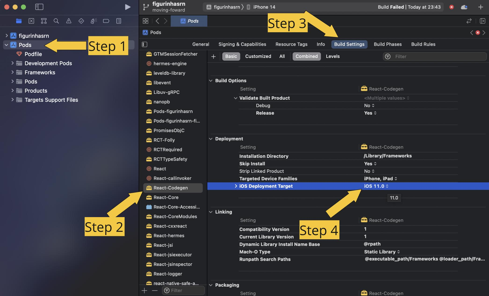

# @kinde-oss/react-native-sdk-0-7x

React Native Client for `@kinde-oss/react-native-sdk-0-7x`
Provides endpoints to manage your Kinde Businesses

> Functions/methods targeting the Management API can only be accessed with tokens generated by the Client Credentials Auth flow at the moment. Since this SDK does not support the Client Credential flow, Management API functions are not available for use. In the future, tokens obtained via other flows would also be able to access the management API functions/methods.

We only support the recommended [Authorization Code Flow with PKCE](https://oauth.net/2/pkce/).
For more information, please visit [https://kinde.com/docs](https://kinde.com/docs)

## Table of contents

-   [Support Versions](#support-versions)
-   [Installing Dependencies](#installing-dependencies)
-   [Installation](#installation)
-   [Getting Started](#getting-started)
-   [Token Storage](#token-storage)
-   [How to run test](#how-to-run-test)
-   [SDK API Reference](#sdk-api-reference)
-   [KindeSDK Methods](#kindesdk-methods)
-   [General Tips](#general-tips)

## Support Versions

We support both **Expo** and **React Native** versions 0.70 and higher.
To use this package with older versions of **React Native**, please visit

-   [react-native-sdk-0-5x _(Not support Expo)_](https://github.com/kinde-oss/react-native-sdk-0-5x)

## Installing Dependencies

You will need Node, the React Native command line interface, a JDK, Android Studio (for Android) and Xcode (for iOS).

Follow [the installation instructions for your chosen OS](https://reactnative.dev/docs/environment-setup) to install dependencies;

## Installation

The SDK can be installed with `npm` or `yarn` but we will use `npm` for code samples.

```shell
npm install @kinde-oss/react-native-sdk-0-7x --save
```

### Android

Checking `MainApplication.java` to verify the `react-native-keychain`, `react-native-inappbrowser-reborn` were added. If not, you need to install manually:

-   Edit `android/settings.gradle`

```java
...

include ':react-native-keychain'
project(':react-native-keychain').projectDir = new File(rootProject.projectDir, '../node_modules/react-native-keychain/android')

include ':react-native-inappbrowser-reborn'
project(':react-native-inappbrowser-reborn').projectDir = new File(rootProject.projectDir, '../node_modules/react-native-inappbrowser-reborn/android')

...
```

-   Edit `android/app/build.gradle`

```java
apply plugin: 'com.android.application'

android {
  ...
}

dependencies {
  ...

  implementation project(':react-native-keychain')
  implementation project(':react-native-inappbrowser-reborn')

  ...
}
```

-   Edit your `MainApplication.java`

```java
...

import com.oblador.keychain.KeychainPackage;
import com.proyecto26.inappbrowser.RNInAppBrowserPackage;
...

public class MainActivity extends extends ReactActivity {
  ...
  @Override
  protected List<ReactPackage> getPackages() {
      return Arrays.<ReactPackage>asList(
              new MainReactPackage(),
              new KeychainPackage(),
              new RNInAppBrowserPackage()
      );
  }

  // or
  @Override
  protected List<ReactPackage> getPackages() {
    @SuppressWarnings("UnnecessaryLocalVariable")
    List<ReactPackage> packages = new PackageList(this).getPackages();
    packages.add(new KeychainPackage());
    packages.add(new RNInAppBrowserPackage());
    return packages;
  }
  ...
}
...
```

#### iOS

You need to updating iOS native dependencies by **CocoaPods**. We recommend installing **CocoaPods** using [Homebrew](https://brew.sh/)

```shell
# Install CocoaPods via brew
brew install cocoapods

# Install iOS native dependencies
cd ios && pod install
```

If the `react-native-keychain` not linked, you need to install manually

**Option: With CocoaPods (High recommended)**

Add the following to your `Podfile` and run pod update:

```Swift
pod 'RNKeychain', :path => '../node_modules/react-native-keychain'
pod 'RNInAppBrowser', :path => '../node_modules/react-native-inappbrowser-reborn'
```

**Option: Manually**

-   Click to `Build Phases` tab
-   Choose `Link Binary With Libraries`
-   Click `+` in bottom
-   **Add Other...** => **Add Files...** => **node_modules/react-native-keychain/RNKeychain.xcodeproj** (similar with RNInAppBrowser)
-   Then, you need to add `libRNKeychain.a`
-   Clean and rebuild

##### [Expo] Installation in Bare React Native

Run this below command to update the package to your npm dependencies:

```bash
expo install expo-secure-store expo-web-browser
// or
npx expo install expo-secure-store expo-web-browser
```

##### Enable `Keychain Sharing` entitlement for iOS 10+

For iOS 10 you'll need to enable the `Keychain Sharing` entitlement in the `Capabilities` section of your build target


## Getting Started

### Kinde configuration

On the Kinde web app navigate to `Settings` in the left menu, then select `Applications` and select the `Frontend app`. Scroll down to the `Callback URLs` section.

Here you want to put in the callback URLs for your React Native app, which should look something like this:

-   Allowed callback URLs - `myapp://myhost.kinde.com/kinde_callback`
-   Allowed logout redirect URLs - `myapp://myhost.kinde.com/kinde_callback`

Make sure you press the Save button at the bottom of the page!

Note: The `myapp://myhost.kinde.com/kinde_callback` is used as an example of local URL Scheme, change to the local local URL Scheme that you use.

### Environments

If you would like to use our Environments feature as part of your development process. You will need to create them first within your Kinde account. In this case you would use the Environment subdomain in the code block above.

### Configuring your app

#### Environment variables

Put these variables in your .env file. You can find these variables on the same page as where you set the callback URLs.

-   `KINDE_ISSUER_URL` - your Kinde domain
-   `KINDE_POST_CALLBACK_URL` - After the user authenticates we will callback to this address. Make sure this URL is under your allowed callback URLs
-   `KINDE_POST_LOGOUT_REDIRECT_URL` - where you want users to be redirected to after logging out. Make sure this URL is under your allowed logout redirect URLs
-   `KINDE_CLIENT_ID` - you can find this on the App Keys page

```javascript
KINDE_ISSUER_URL=https://your_kinde_domain.kinde.com
KINDE_POST_CALLBACK_URL=myapp://your_kinde_domain.kinde.com/kinde_callback
KINDE_POST_LOGOUT_REDIRECT_URL=myapp://your_kinde_domain.kinde.com/kinde_callback
KINDE_CLIENT_ID=your_kinde_client_id
```

### Configuration Deep link

#### With React Native

##### iOS

On iOS, you'll need to link `RCTLinking` to your project by following the steps described here. If you also want to listen to incoming app links during your app's execution, you'll need to add the following lines to your `AppDelegate.m`

```swift
// iOS 9.x or newer
#import <React/RCTLinkingManager.h>

- (BOOL)application:(UIApplication *)application
   openURL:(NSURL *)url
   options:(NSDictionary<UIApplicationOpenURLOptionsKey,id> *)options
{
  return [RCTLinkingManager application:application openURL:url options:options];
}
```

If you're targeting iOS 8.x or older, you can use the following code instead:

```swift
// iOS 8.x or older
#import <React/RCTLinkingManager.h>

- (BOOL)application:(UIApplication *)application openURL:(NSURL *)url
  sourceApplication:(NSString *)sourceApplication annotation:(id)annotation
{
  return [RCTLinkingManager application:application openURL:url
                      sourceApplication:sourceApplication annotation:annotation];
}
```

Please make sure you have configuration URL scheme in `Info.plist`, so app can be opened by deep link:

```swift
...
<key>CFBundleURLTypes</key>
<array>
  <dict>
    <key>CFBundleTypeRole</key>
    <string>Editor</string>
    <key>CFBundleURLName</key>
    <string>myapp</string> // you can change it
    <key>CFBundleURLSchemes</key>
    <array>
      <string>myapp</string> // you can change it
    </array>
  </dict>
</array>
...
```

##### Android

Open `AndroidManifest.xml` and update your scheme:

```xml
<intent-filter>
    <action android:name="android.intent.action.VIEW" />
    <category android:name="android.intent.category.DEFAULT" />
    <category android:name="android.intent.category.BROWSABLE" />
    <data android:scheme="myapp" android:host="your_kinde_issuer.kinde.com" />  // you can change it
</intent-filter>
```

#### With Expo

#### Linking to your app

To link to your [development](https://docs.expo.dev/development/introduction/) build or standalone app, you need to specify a custom URL scheme for your app. You can register a scheme in your Expo config (**app.json**, **app.config.js**) by adding a string under the `scheme` key:

```json
{
  "expo": {
    "scheme": "myapp",
    ...
  }
}
```

#### Linking to Expo Go

[Expo Go](https://expo.dev/expo-go) uses the `exp://` scheme, however, if we link to `exp://` without any address afterward, it will open the app to the home screen.

In development, your app will live at a url like `exp://127.0.0.1:19000`. When published, an experience will be hosted at a URL like ` exp://u.expo.dev/[project-id]?channel-name=[channel-name]&runtime-version=[runtime-version]`, where `u.expo.dev/[project-id]` is the hosted URL that Expo Go fetches from.
_**Note**: You also should update your callback url to both your app and Kinde:_

```javascript
KINDE_ISSUER_URL=https://your_kinde_domain.kinde.com
KINDE_POST_CALLBACK_URL=exp://your_machine_ip:your_machine_port // f.e: exp://127.0.0.1:19000
KINDE_POST_LOGOUT_REDIRECT_URL=exp://your_machine_ip:your_machine_port // f.e: exp://127.0.0.1:19000
KINDE_CLIENT_ID=your_kinde_client_id
```

### Integration your app

You’ll need to create a new instance of the Kinde Auth client object. Please execute this code below:

```javascript
...
import { KindeSDK } from '@kinde-oss/react-native-sdk-0-7x';
...

...
const client = new KindeSDK(YOUR_KINDE_ISSUER, YOUR_KINDE_REDIRECT_URI, YOUR_KINDE_CLIENT_ID, YOUR_KINDE_LOGOUT_REDIRECT_URI);
...
```

### Login / Register

The Kinde client provides methods for an easy to implement login / register flow.
As an example if you add buttons in your render as follows:

```javascript
<View>
    <View>
        <Button title="Sign In" onPress={handleSignIn} />
    </View>
    <View>
        <Button title="Sign Up" color="#000" onPress={handleSignUp} />
    </View>
</View>
```

Then define new functions that match for each button:
_**Note**: Make sure you've already defined KindeSDK as `client`_

```javascript
...
const handleSignUp = async () => {
  const token = await client.register();
  if (token) {
    // User was authenticated
  }
};

const handleSignIn = async () => {
  const token = client.login();
  if (token) {
    // User was authenticated
  }
};
...
```

### ~~Handle redirect~~ [Deprecated]

**_Note_: Since version 1.1, handling redirection is no longer necessary because the SDK authenticates by starting a web browser inside your app rather than using an external one. Details regarding implementations can be found at: [Full code sample for the authentication](#full-code-sample-for-the-authentication)**

After the user logs in to Kinde, it will be redirected to your app via a deep link, which includes some information (e.g., code) as parameters, and then you need to call the `getToken` method to receive a token from Kinde. The SDK will store the token on the keychain. Now, the user will be authenticated without logging in again.

##### ~~Handle redirect with React Native~~

```javascript
...
import { Linking } from 'react-native';
...

const handleCallback = async (url) => {
  try {
    const token = await client.getToken(url);
    console.log('token here', token);
  } catch (e) {
    // Perhaps the deep link is not from Kinde authentication, or something went wrong. Logging the error to see detail
    console.error('ERR getToken', e);
  }
}

const checkAuthenticate = async () => {
  if (await client.isAuthenticated) { // Using `isAuthenticated` to check if the user is authenticated or not
    // Need to implement, e.g: call an api,etc... In this case, we will get a token:
    const token = await client.getToken();
    console.log('token here', token);
  } else {
    // Need to implement, e.g: redirect user to sign in or sign up screens,etc...
  }
}

useEffect(() => {
  Linking.getInitialURL()
    .then(url => {
      if (url) {
        return handleCallback(url);
      }
      checkAuthenticate();
    })
    .catch(err => console.error('An error occurred', err));

  const onChangeURL = (event: {url: string}) => {
    if (event.url) {
      handleCallback(event.url);
    }
  };
  Linking.addEventListener('url', onChangeURL);

  return () => {
    Linking.removeAllListeners('url');
  };
}, []);
```

##### ~~Handle redirect with Expo~~

You must install `expo-linking`. This provides utilities for your app to interact with other installed apps using deep links. It also provides helper methods for constructing and parsing deep links into your app. This module is an extension of the React Native [Linking](https://reactnative.dev/docs/linking.html) module.

```javascript
...
import * as Linking from "expo-linking";
...

const client = new KindeSDK(
  YOUR_KINDE_ISSUER,
  YOUR_KINDE_REDIRECT_URI,
  YOUR_KINDE_CLIENT_ID,
  YOUR_KINDE_LOGOUT_REDIRECT_URI
)

const url = Linking.useURL();

const checkAuthenticate = async () => {
  if (await client.isAuthenticated) { // Using `isAuthenticated` to check if the user is authenticated or not
    // Need to implement, e.g: call an api,etc... In this case, we will get a token:
    const token = await client.getToken();
    console.log('token here', token);
  } else {
    // Need to implement, e.g: redirect user to sign in or sign up screens,etc...
  }
}

useEffect(() => {
  checkAuthenticate();
}, []);

const handleCallback = async (url) => {
  try {
    const token = await client.getToken(url);
    console.log('token here', token);
  } catch (e) {
    // Perhaps the deep link is not from Kinde authentication, or something went wrong. Logging the error to see detail
    console.error('ERR getToken', e);
  }
}

useEffect(() => {
  if (url) {
    handleCallback(url);
  }
}, [url]);
```

### Logout

This is implemented in much the same way as logging in or registering. The Kinde SPA client comes with a logout method

```javascript
const handleLogout = async () => {
    const loggedOut = client.logout();
    if (loggedOut) {
        // User was logged out
    }
};
```

We have also implemented an API for token revocation. Simply pass `true` as an argument in the `logout` function. This flag will assist in revoking the token without having to open the website within your apps.

```javascript
const handleLogout = async () => {
    const loggedOut = client.logout(true);
    if (loggedOut) {
        // User was logged out
    }
};
```

### Full code sample for the authentication

```javascript
const checkAuthenticate = async () => {
    // Using `isAuthenticated` to check if the user is authenticated or not
    if (await client.isAuthenticated) {
        // Need to implement, e.g: call an api, etc...
    } else {
        // Need to implement, e.g: redirect user to sign in, etc..
    }
};

useEffect(() => {
    checkAuthenticate();
}, []);

const handleSignIn = async () => {
    const token = await client.login();

    if (token) {
        // Need to implement, e.g: call an api, etc...
    }
};

const handleSignUp = async () => {
    const token = await client.register();

    if (token) {
        // Need to implement, e.g: call an api, etc...
    }
};

const handleLogout = async () => {
    // With open web in your apps
    const isLoggedOut = await client.logout();

    if (isLoggedOut) {
        // Need to implement, e.g: redirect user to login screen, etc...
    }

    // Without open web in your apps
    const isLoggedOut = await client.logout(true);

    if (isLoggedOut) {
        // Need to implement, e.g: redirect user to login screen, etc...
    }
};
```

### Get user information

To access the user information, use the `getUserDetails` helper function:

```javascript
const userProfile = await client.getUserDetails();
console.log(userProfile);
// output: {"given_name":"Dave","id":"abcdef","family_name":"Smith","email":"dave@smith.com"}
```

### View users in Kinde

If you navigate to the "Users" page within Kinde you will see your newly registered user there. 🚀

### User Permissions

Once a user has been verified as login in, your product/application will be returned the JWT token with an array of permissions for that user. You will need to configure your product/application to read permissions and unlock the respective functions.

You set Permissions in your Kinde account (see help article), the below is an example set of permissions.

```javascript
const permissions = [
    'create:todos',
    'update:todos',
    'read:todos',
    'delete:todos',
    'create:tasks',
    'update:tasks',
    'read:tasks',
    'delete:tasks'
];
```

We provide helper functions to more easily access permissions:

```javascript
await client.getPermission('create:todos');
// {orgCode: "org_1234", isGranted: true}

await client.getPermissions();
// {orgCode: "org_1234", permissions: ["create:todos", "update:todos", "read:todos"]}
```

A practical example in code might look something like:

```javascript
if ((await client.getPermission('create:todos')).isGranted) {
    // show Create Todo button in UI
}
```

### Audience

An `audience` is the intended recipient of an access token - for example the API for your application. The audience argument can be passed to the Kinde client to request an audience be added to the provided token.

The audience of a token is the intended recipient of the token.

```javascript
const client = new KindeSDK(
    YOUR_KINDE_ISSUER,
    YOUR_KINDE_REDIRECT_URI,
    YOUR_KINDE_CLIENT_ID,
    YOUR_KINDE_LOGOUT_REDIRECT_URI,
    YOUR_SCOPES,
    {
        audience: 'api.yourapp.com'
    }
);
```

For details on how to connect, see [Register an API](https://kinde.com/docs/developer-tools/register-an-api/)

### Overriding scope

By default the KindeSDK SDK requests the following scopes:

-   profile
-   email
-   offline
-   openid

You can override this by passing scope into the KindeSDK

```javascript
const client = new KindeSDK(
    YOUR_KINDE_ISSUER,
    YOUR_KINDE_REDIRECT_URI,
    YOUR_KINDE_CLIENT_ID,
    YOUR_KINDE_LOGOUT_REDIRECT_URI,
    'profile email offline openid'
);
```

### Getting claims

We have provided a helper to grab any claim from your id or access tokens. The helper defaults to access tokens:

```javascript
await client.getClaim('aud');
// ["api.yourapp.com"]

await client.getClaim('given_name', 'id_token');
// "David"
```

### Organizations Control

#### Create an organization

To have a new organization created within your application, you will need to run a similar function to below:

```javascript
<Button title="Create Organization" onPress={handleCreateOrg} />
```

Then define new function that match for button:
**\*Note**: Make sure you've already defined KindeSDK as `client` in the state\*

```javascript
const handleCreateOrg = () => {
  client.createOrg();
}

// You can also pass `org_name` as your organization
client.createOrg({org_name: 'Your Organization'});
...
```

#### Sign in and sign up to organizations

Kinde has a unique code for every organization. You’ll have to pass this code through when you register a new user. Example function below:

```javascript
client.register({ org_code: 'your_org_code' });
```

If you want a user to sign in into a particular organization, pass this code along with the sign in method.

```javascript
client.login({ org_code: 'your_org_code' });
```

Following authentication, Kinde provides a json web token (jwt) to your application. Along with the standard information we also include the org_code and the permissions for that organization (this is important as a user can belong to multiple organizations and have different permissions for each). Example of a returned token:

```json
{
    "aud": [],
    "exp": 1658475930,
    "iat": 1658472329,
    "iss": "https://your_subdomain.kinde.com",
    "jti": "123457890",
    "org_code": "org_1234",
    "permissions": ["read:todos", "create:todos"],
    "scp": ["openid", "profile", "email", "offline"],
    "sub": "kp:123457890"
}
```

The `id_token` will also contain an array of Organizations that a user belongs to - this is useful if you wanted to build out an organization switcher for example.

```json
{
  ...
  "org_codes": ["org_1234", "org_4567"]
  ...
}
```

There are two helper functions you can use to extract information:

```javascript
await client.getOrganization();
// {orgCode: "org_1234"}

await client.getUserOrganizations();
// {orgCodes: ["org_1234", "org_abcd"]}
```

## Token Storage

Once the user has successfully authenticated, you'll have a JWT and a refresh token and that has been stored securely.
E.g., using the `getAccessToken` method of `the Storage` class to get an access token:

```javascript
...
import Storage from '@kinde-oss/react-native-sdk-0-7x'
...


const accessToken = await Storage.getAccessToken();
console.log('access_token', accessToken);
```

We're using the [react-native-keychain](https://www.npmjs.com/package/react-native-keychain) for `React Native` and the [expo-secure-store](https://www.npmjs.com/package/expo-secure-store) for `Expo`.
The storage handler can be found at: [Storage class](./dist/SDK/Storage/index.d.ts)

## How to run test

The simplest way to run the test suite is by using the following command at the root of your React Native:

```bash
npm run test
```

_Note: Ensure you have already run `npm install` before_

## SDK API Reference

| Property                        | Type    | Is required | Default                      | Description                                                                                                       |
| ------------------------------- | ------- | ----------- | ---------------------------- | ----------------------------------------------------------------------------------------------------------------- |
| issuer                          | string  | Yes         |                              | Either your Kinde instance url or your custom domain. e.g [https://yourapp.kinde.com](https://yourapp.kinde.com/) |
| redirectUri                     | string  | Yes         |                              | The url that the user will be returned to after authentication                                                    |
| clientId                        | string  | Yes         |                              | The id of your application - get this from the Kinde admin area                                                   |
| logoutRedirectUri               | string  | No          |                              | Where your user will be redirected upon logout                                                                    |
| scope                           | boolean | No          | openid profile email offline | The scopes to be requested from Kinde                                                                             |
| additionalParameters            | object  | No          | {}                           | Additional parameters that will be passed in the authorization request                                            |
| additionalParameters - audience | string  | No          |                              | The audience claim for the JWT                                                                                    |

## KindeSDK Methods

| Property             | Description                                                                                       | Arguments                             | Usage                                                                                                                                                                                 | Sample output                                                                                                                                                                                                                |
| -------------------- | ------------------------------------------------------------------------------------------------- | ------------------------------------- | ------------------------------------------------------------------------------------------------------------------------------------------------------------------------------------- | ---------------------------------------------------------------------------------------------------------------------------------------------------------------------------------------------------------------------------- |
| login                | Constructs redirect url and sends user to Kinde to sign in                                        | {<br>org_code?: string<br>}           | await kinde.login(); or<br>await kinde.login({org_code: 'your organization code'}) // Allow org_code to be provided if a specific org is to be signed up into.                        | {<br>"access_token": "eyJhbGciOiJSUzI...",<br>"expires_in": 86400,<br>"id_token": "eyJhbGciOiJSU...",<br>"refresh_token": "yXI1bFQKbXKLD7AIU...",<br>"scope": "openid profile email offline",<br>"token_type": "bearer"<br>} |
| register             | Constructs redirect url and sends user to Kinde to sign up                                        | {<br>org_code?: string<br>}           | await kinde.register(); or<br>await kinde.register({org_code: 'your organization code'}) // Allow org_code to be provided if a specific org is to be registered into.                 | {<br>"access_token": "eyJhbGciOiJSUzI...",<br>"expires_in": 86400,<br>"id_token": "eyJhbGciOiJSU...",<br>"refresh_token": "yXI1bFQKbXKLD7AIU...",<br>"scope": "openid profile email offline",<br>"token_type": "bearer"<br>} |
| logout               | Logs the user out of Kinde                                                                        | isRevoke: boolean // default is false | await kinde.logout(); or <br> await kinde.logout(true);                                                                                                                               | true or false                                                                                                                                                                                                                |
| getToken             | Returns the raw Access token from URL after logged from Kinde                                     | url?: string                          | kinde.getToken(url); or<br>kinde.getToken(); // In this case, you have already authenticated before. Otherwise, an error will be thrown in here                                       | {<br>"access_token": "eyJhbGciOiJSUzI...",<br>"expires_in": 86400,<br>"id_token": "eyJhbGciOiJSU...",<br>"refresh_token": "yXI1bFQKbXKLD7AIU...",<br>"scope": "openid profile email offline",<br>"token_type": "bearer"<br>} |
| createOrg            | Constructs redirect url and sends user to Kinde to sign up and create a new org for your business | {<br>org_name?: string<br>}           | await kinde.createOrg(); or<br>await kinde.createOrg({org_name: 'your organization name'}); // Allow org_name to be provided if you want a specific organization name when you create | {<br>"access_token": "eyJhbGciOiJSUzI...",<br>"expires_in": 86400,<br>"id_token": "eyJhbGciOiJSU...",<br>"refresh_token": "yXI1bFQKbXKLD7AIU...",<br>"scope": "openid profile email offline",<br>"token_type": "bearer"<br>} |
| getClaim             | Gets a claim from an access or id token                                                           | claim: string;<br>tokenKey?: string   | await kinde.getClaim('given_name', 'id_token');                                                                                                                                       | "David"                                                                                                                                                                                                                      |
| getPermission        | Returns the state of a given permission                                                           | key: string                           | await kinde.getPermission('read:todos');                                                                                                                                              | {"orgCode":"org_1234","isGranted":true}                                                                                                                                                                                      |
| getPermissions       | Returns all permissions for the current user for the organization they are logged into            |                                       | await kinde.getPermissions();                                                                                                                                                         | {"orgCode":"org_1234","permissions":["create:todos","update:todos","read:todos"]}                                                                                                                                            |
| getOrganization      | Get details for the organization your user is logged into                                         |                                       | await kinde.getOrganization();                                                                                                                                                        | {"orgCode": "org_1234"}                                                                                                                                                                                                      |
| getUserDetails       | Returns the profile for the current user                                                          |                                       | await kinde.getUserDetails();                                                                                                                                                         | {"given_name":"Dave","id":"abcdef","family_name":"Smith","email":"dave@smith.com"}                                                                                                                                           |
| getUserOrganizations | Gets an array of all organizations the user has access to                                         |                                       | await kinde.getUserOrganizations();                                                                                                                                                   | {"orgCodes":["org1​234","org5​678"]}                                                                                                                                                                                         |
| isAuthenticated      | Return the boolean to demonstrate whether the user is authenticated or not.                       |                                       | await kinde.isAuthenticate                                                                                                                                                            | true or false                                                                                                                                                                                                                |

## General Tips

### Building Issues

##### `'value'` is unavailable: introduced in iOS 12.0

If you got the error `'value' is unavailable: introduced in iOS 12.0` when trying to build the app, you can follow the below steps to fix that:

1. In your Xcode project navigator, select `Pods`
2. Under Targets, select `React-Codegen`
3. Set the window to `Build Settings`
4. Under `Deployment`, set `iOS Deployment Target` to `12.4`
5. Clean project and rebuild: `Product > Clean Build Folder, Product > Build`



##### Dependency `'androidx.browser:browser:1.6.0-beta01'` requires libraries and applications that depend on it to compile against version 34 or later of the Android APIs.

The solution is add `androidXBrowser = "1.5.0"` in your project.

```java
// android/build.gradle
buildscript {
    ...
    ext {
        // ...
        androidXBrowser = "1.5.0"
        // ....
    }
    ...
}
```

##### Duplicate class kotlin.collections.jdk8.CollectionsJDK8Kt found in modules jetified-kotlin-stdlib-1.8.10 (org.jetbrains.kotlin:kotlin-stdlib:1.8.10) and jetified-kotlin-stdlib-jdk8-1.7.22 (org.jetbrains.kotlin:kotlin-stdlib-jdk8:1.7.22)

The solution is add `org.jetbrains.kotlin:kotlin-bom:1.8.0` dependency in your project.

```java
// android/app/build.grade
dependencies {
    ...
    implementation(platform("org.jetbrains.kotlin:kotlin-bom:1.8.0"))
    ...
}
```

### Caching Issues

Sometimes there will be issues related to caching when you develop React Native.
There are some recommendations for cleaning the cache:

1. Remove `node_modules`, `yarn.lock` or `package-lock.json`
2. Clean cache: `yarn cache clean` or `npm cache clean --force`
3. Make sure you have changed values in `.env` file
4. Trying to install packages again: `yarn install` or `npm install`
5. Run Metro Bundler: `yarn start --reset-cache` or `npm start --reset-cache`

Assume your project path is `<StarterKit_PATH>`.

##### With Android:

1. Clean cache:

```bash
cd <StarterKit_PATH>/android
./gradlew clean
```

2. Follow the steps in the above `General tips`.

##### With iOS:

1. Follow the steps at the above `General tips`.
2. Clean cache:

```bash
cd <StarterKit_PATH>/ios
rm -rf Pods && rm Podfile.lock
```

3. Clean build folders on Xcode.

If you need any assistance with getting Kinde connected reach out to us at support@kinde.com.
